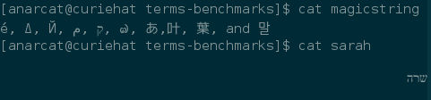
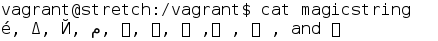

Terminal emulators benchmarking suite
=====================================

This repository holds test scripts and results for a LWN article about
terminal emulators written in 2017-2018.

<!-- markdown-toc start - Don't edit this section. Run M-x markdown-toc-generate-toc again -->
**Table of Contents**

- [Terminal emulators benchmarking suite](#terminal-emulators-benchmarking-suite)
- [Methodology](#methodology)
- [Feature tests](#feature-tests)
    - [Unicode](#unicode)
    - [Paste protection](#paste-protection)
    - [Tabs and profiles](#tabs-and-profiles)
    - [Eye candy](#eye-candy)
    - [Original feature review](#original-feature-review)
- [Performance tests](#performance-tests)
    - [Latency](#latency)
    - [Resources](#resources)
- [Qualitative evaluation](#qualitative-evaluation)
    - [urxvt](#urxvt)
    - [gnome-termixnal](#gnome-termixnal)
    - [xterm](#xterm)
    - [xvt](#xvt)
    - [pterm (putty)](#pterm-putty)
    - [kterm](#kterm)
    - [mrxvt](#mrxvt)
    - [mlterm](#mlterm)
    - [xfce4-terminal](#xfce4-terminal)
    - [eterm](#eterm)
    - [st](#st)
    - [alacritty](#alacritty)
    - [konsole](#konsole)
    - [Terminator](#terminator)
    - [Terminus](#terminus)
- [Not evaluated](#not-evaluated)
- [Final notes](#final-notes)
- [Future work](#future-work)

<!-- markdown-toc end -->

Methodology
===========

Those tests were built over a period of 6 months, with variable
methodology for different tests. Two main family of tests were
performed: features and performance.

Unless otherwise noted, all tests were performed with the same
hardware (Intel i3-6100U CPU @ 2.30GHz, 16GiB DD4 RAM, Intel HD
Graphics 520 controller and 1680x1050 screen @ 59.95Hz). If
customization was performed on the terminal, a note was added in the
summary. Some terminals had to use a special font for the latency test
to work (e.g. using the then-standard `-font
'-adobe-courier-medium-r-normal--14-100-100-100-m-90-iso8859-1'`
argument), but were otherwise using the default font. A unicode locale
(either `fr_CA.UTF-8` or `en_US.UTF-8`) was used for all tests.

A battery of tests were done in July 17 on Debian 9.0, and tests were
redone in March 2018 on Debian 9.4 and Fedora 27.

| Terminal            | Debian        | Fedora  | Upstream | Notes                                      |
| ------------------- | ------------- | ------- | -------- | ------------------------------------------ |
| [Alacritty][]       | N/A           | N/A     | 6debc4f  | no releases Git head                       |
| [GNOME Terminal][]  | 3.22.2        | 3.26.2  | 3.28.0   | uses GTK3, [VTE][]                         |
| [Konsole][]         | 16.12.0       | 17.12.2 | 17.12.3  | uses KDE libraries                         |
| [mlterm][]          | 3.5.0         | 3.7.0   | 3.8.5    | uses VTE, "Multi-lingual terminal"         |
| [pterm][]           | 0.67          | 0.70    | 0.70     | [PuTTY][] without ssh, uses GTK2           |
| [st][]              | 0.6           | 0.7     | 0.8.1    | "simple terminal"                          |
| [Terminator][]      | 1.90+bzr-1705 | 1.91    | 1.91     | uses GTK3, VTE                             |
| [urxvt][]           | 9.22          | 9.22    | 9.22     | main rxvt fork, also known as rxvt-unicode |
| [Xfce Terminal][]   | 0.8.3         | 0.8.7   | 0.8.7.2  | uses GTK3, VTE                             |
| [xterm][]           | 327           | 330     | 331      | the original X terminal                    |

 [Alacritty]: https://github.com/jwilm/alacritty
 [GNOME Terminal]: https://wiki.gnome.org/Apps/Terminal
 [Konsole]: https://konsole.kde.org/
 [kterm]: https://ja.wikipedia.org/wiki/Kterm
 [mlterm]: http://mlterm.sourceforge.net/
 [mrxvt]: https://en.wikipedia.org/wiki/Mrxvt
 [pterm]: https://manpages.debian.org/pterm
 [PuTTY]: https://www.chiark.greenend.org.uk/~sgtatham/putty/
 [st]: https://st.suckless.org/
 [Terminator]: https://gnometerminator.blogspot.ca/
 [VTE]: https://github.com/GNOME/vte
 [urxvt]: http://software.schmorp.de/pkg/rxvt-unicode.html
 [Xfce Terminal]: https://docs.xfce.org/apps/terminal/start
 [XTerm]: http://invisible-island.net/xterm/

Alacritty was only tested on Debian and doesn't have tagged releases
yet. The latest commit available at the time of writing was:

    commit 6debc4f3351446417d0c4e38173cd9ef0faa71d5
    Author: YOSHIOKA Takuma <lo48576@hard-wi.red>
    Date:   Tue Mar 13 20:16:01 2018 +0900

        Try to create window with different SRGB config when failed
        
        This may truly solve #921 (and issue caused by #1178)
        <https://github.com/jwilm/alacritty/issues/921#issuecomment-372619121>.

mlterm is not shipped with Fedora by default, so this [copr
repository](https://copr.fedorainfracloud.org/coprs/rabiny/mlterm/) was used as an alternative. Because it only supports
F26 out of the box, the `.repo` file was modified to hardcode the
version number:

    --- /etc/yum.repos.d/rabiny-mlterm.repo.orig	2018-03-28 17:06:43.048093670 -0400
    +++ /etc/yum.repos.d/rabiny-mlterm.repo	2018-03-28 17:06:19.671757651 -0400
    @@ -1,6 +1,6 @@
     [rabiny-mlterm]
     name=Copr repo for mlterm owned by rabiny
    -baseurl=https://copr-be.cloud.fedoraproject.org/results/rabiny/mlterm/fedora-$releasever-$basearch/
    +baseurl=https://copr-be.cloud.fedoraproject.org/results/rabiny/mlterm/fedora-26-$basearch/
     type=rpm-md
     skip_if_unavailable=True
     gpgcheck=1

Feature tests
=============

Those results cover the first part of the series, the features.

Unicode
-------

Unicode rendering tests were performed in a Debian Stretch 9.4
virtual machine, using the following procedure:

    vagrant up debian/stretch64
    vagrant ssh -c "sudo apt install xorg xterm rxvt-unicode mlterm kterm gnome-terminal blackbox"
    vagrant ssh -c "echo 'w6ksIM6ULCDQmSwg16cgLNmFLCDguZcsIOOBgizlj7YsIOiRiSwgYW5kIOunkAo=' | base64 -d > magicstring"

Then start VirtualBox, login (vagrant/vagrant) and start a GUI:

    xinit blackbox

Tests were also performed on a clean, on-disk Fedora 27 install.

Once a GUI is available, start the terminal and cat the magic file:

    cat magicstring

The magic string was taken [from the Wikipedia Unicode page](https://en.wikipedia.org/wiki/Unicode#Web), with
a "é" added to make the string a little more familiar to western readers:

> For example, the references &#916;, &#1049;, &#1511;, &#1605;,
> &#3671;, &#12354;, &#21494;, &#33865;, and &#47568; (or the same
> numeric values expressed in hexadecimal, with &#x as the prefix)
> should display on all browsers as Δ, Й, ק ,م, ๗, あ, 叶, 葉, and 말.

In the magic string, all characters should be displayed properly, as
long as *one* font on the system supports the script, even if it's not
the font configured in the terminal. The Qoph and Mem characters
should also be display "backwards", that is "right-to-left: the mem
character should visually be displayed right after the Yot character
(`Й`) even if it's actually listed after Qoph.

Another magic string that was tested is the Hebrew name "Sarah"
(`שרה`, or `16nXqNeUCg==`), taken from the [bi-directional text
wikipedia page](https://en.wikipedia.org/wiki/Bi-directional_text):

> Many computer programs fail to display bi-directional text
> correctly. For example, the Hebrew name Sarah (שרה) is spelled: sin
> (ש) (which appears rightmost), then resh (ר), and finally heh (ה)
> (which should appear leftmost).

As a reference, the two test strings display up correctly in Emacs 25
on Fedora 27 and Debian 9. The two strings should look like this:



To perform the test, the above two strings were stored in two distinct
files ([magicstring](magicstring) and [sarah](sarah)) and displayed, one at a time,
with two distinct `cat` commands:

```
[anarcat@curiehat terms-benchmarks]$ cat magicstring
é, Δ, Й, ק ,م, ๗, あ,叶, 葉, and 말
[anarcat@curiehat terms-benchmarks]$ cat sarah

שרה

```

Note that the word "sarah" is surrounded by newlines otherwise it does
not show up correctly in Emacs, which directions are per paragraph,
not per line. Also note that Firefox displays the first string
correctly, but fails to align the sarah string to right. I will not
try to lose myself in the mists to figure out why this happens: if
anything, it could be that browsers do this per DOM block or for the
whole document.

Here are the results of a test performed on Debian 9 and verified on
Fedora 27:

| Terminal            | All | Order | From right |
| ------------------- | --- | ----  | ---------- |
| [Alacritty][]       |  ✓  |  x    |     x      |
| [GNOME Terminal][]  |  ✓  |  x    |     x      |
| [Konsole][]         |  ✓  |  ✓    |     x      |
| [mlterm][]          |  ✓¹ |  ✓    |     ✓      |
| [pterm][]           |  ✓  |  ✓    |     ✓      |
| [urxvt][]           |  ✓  |  x    |     x      |
| [st][]              |  ✓  |  x    |     x      |
| [Terminator][]      |  ✓  |  x    |     x      |
| [Xfce Terminal][]   |  ✓  |  x    |     x      |
| [xterm][]           |  x  |  x    |     x      |

¹ mlterm 3.5, as packaged in Debian, does not render all characters
properly, most of them being rendered as boxes:



Details:

 * All: all characters are properly displayed in the default configuration
 * Order: The "mem" and "qoph" characters are in the proper order
 * From right: the "Sara" word is display from the right margin

Paste protection
----------------

Here the test is to copy-paste the text in the first and second test
boxes from [Jann Horn's test site](http://thejh.net/misc/website-terminal-copy-paste). Text was copied using the
`CLIPBOARD` buffer (`control-c`, `control-v`) when possible, otherwise
the middle mouse button was used to copy the content of the
boxes. Here are the results, with and without the `.inputrc`
configuration in Bash:

| Terminal            | without  | with, 2nd box |
| ------------------- | -------- | ------------- |
| [Alacritty][]       |  x       |       x       |
| [GNOME Terminal][]  |  x       |       ✓       |
| [Konsole][]         |  x       |       x       |
| [mlterm][]          |  x       |       x       |
| [pterm][]           |  x       |       x       |
| [st][]              |  x       |       x       |
| [Terminator][]      |  x       |       ✓       |
| [urxvt][]           |  x       |       x       |
| urxvt+confirm-paste |  ✓       |       ✓       |
| [Xfce Terminal][]   |  x       |       ✓       |
| [xterm][]           |  x       |       ✓       |

 * without: test results without a `.inputrc` configured, same in the
   two boxes
 * with, 2nd box: test with a `.inputrc`, but with the second box
   (first box always succeeds in all tested terminals)

The test succeeds if the commands are *not* ran.

The magic `.inputrc` line is:

	set enable-bracketed-paste on

This was tested on Debian 9 and Fedora 27.

Tabs and profiles
-----------------

| Terminal            | Tabs | Profiles | Linked |
| ------------------- | ---- | -------- | ------ |
| [Alacritty][]       |  x   |    x     |  N/A   |
| [GNOME Terminal][]  |  ✓   |    ✓     |   ✓    |
| [Konsole][]         |  ✓   |    ✓     |   ✓    |
| [mlterm][]          |  x   |    x     |  N/A   |
| [pterm][]           |  x   |    x     |  N/A   |
| [st][]              |  x   |    x     |  N/A   |
| [Terminator][]      |  ✓   |    ✓     |   x³   |
| [urxvt][]           |  ✓²  |    x     |   x    |
| [Xfce Terminal][]   |  ✓   |    x     |  N/A   |
| [xterm][]           |  x   |    x     |  N/A   |

² urxvt supports tabs through a plugin.

³ I couldn't figure out how to start a given profile in a given
Terminator tab.

 * Tabs: display and manage multiple tabs (`!` means through a plugin)
 * Profiles: if custom settings or command can be retained in
   different profiles
 * Linked: if specific tabs can be made to start a specific profile
   out of the box. not applicable (N/A) for terminals without profile
   support, obviously.

This was verified by clicking around the terminal's GUI and looking at
documentation, first on Debian 9 and then confirmed on Fedora 27.

Eye candy
---------

This is more of a qualitative evaluation. This was done by inspecting
the visible menus in the application and some reference manuals.

| Terminal            | backgrounds | transparency | true-color | URL | text-wrap | scrollback |
| ------------------- | ----------- | ------------ | ---------- | --- | --------- | ---------- |
| [Alacritty][]       |     x       |      x       |     ✓      |  x  |    x      |      x     |
| [GNOME Terminal][]  |     ✓       |      ✓       |     ✓      |  ✓  |    ✓      |      ✓     |
| [Konsole][]         |     x       |      x       |     ✓      |  ✓  |    x      |      ✓     |
| [mlterm][]          |     ✓       |      ✓       |     ✓⁴     |  x  |    x      |      ✓     |
| [pterm][]           |     x       |      x       |     x      |  x  |    x      |      ✓     |
| [st][]              |     x       |      x       |     ✓      |  x  |    x      |      x     |
| [Terminator][]      |     x       |      ✓       |     ✓      |  ✓  |    ✓      |      ✓     |
| [urxvt][]           |     ✓       |      ✓       |     x      |  ✓  |    ✓      |      ✓     |
| [Xfce Terminal][]   |     ✓       |      ✓       |     ✓      |  ✓  |    ✓      |      ✓     |
| [xterm][]           |     x       |      x       |     x      |  x  |    x      |      ✓     |

⁴ mlterm fails the true-color test in Debian but succeeds in F27.

 * Backgrounds: if arbitrary images can be set in the background
 * Transparency: if we can see under the windows
 * True-color: does the terminal display more than 256 colors?
 * URL: detect URLs and make them clickable or activate with a
   keybinding
 * text-wrap: properly reflow long lines instead of trimming or
   stripping them
 * Scrollback: if screen history is preserved

The true-color test was the following:

    awk 'BEGIN{
        s="/\\/\\/\\/\\/\\"; s=s s s s s s s s;
        for (colnum = 0; colnum<77; colnum++) {
            r = 255-(colnum*255/76);
            g = (colnum*510/76);
            b = (colnum*255/76);
            if (g>255) g = 510-g;
            printf "\033[48;2;%d;%d;%dm", r,g,b;
            printf "\033[38;2;%d;%d;%dm", 255-r,255-g,255-b;
            printf "%s\033[0m", substr(s,colnum+1,1);
        }
        printf "\n";
    }'

The text-wrap test consists of showing the `tail` of a file with long
lines, for example a logfile (e.g. `/var/log/messages` in Debian or
`/var/log/dnf.log` in Fedora), and resizing the windows. A successful
test will keep all characters as the window is resized, and reflow
long lines. A failure is, for example, when characters disappear when
a window is shrinked and expanded or when an expanded window doesn't
rejoin long lines previously broken up.

All tests were done on Debian 9 and verified Fedora 27.

Original feature review
-----------------------

This is a more elaborate table of tests performed on Debian 9 in July,
but not validated on later versions with Fedora 27.

| Terminal   | backgrounds | transparency | freetype | true-color | profiles | scripting | daemon | tab | URL | paste | text-wrap | scrollback | unicode | version         |
| ---------- | ----------- | ------------ | -------- | ---------- | -------- | --------- | ------ | --- | --- | ----- | --------- | ---------- | ------- | --------------- |
| alacritty  |             |              |    ✓     |     ✓      |          |           |        |     |     |       |           |            |    ✓    | 3df394d         |
| gnome      |     ✓       |      ✓       |    ✓     |     ✓      |    ✓     |           |        |  ✓  |  ✓  |       |    ✓      |      ✓     |    ✓    | 3.22.2-1        |
| konsole    |             |              |    ✓     |     ✓      |    ✓     |     ✓     |        |  ✓  |  ✓  |       |           |      ✓     |    ✓    | 4:16.12.0-4     |
| kterm      |             |              |          |            |          |           |        |     |     |       |           |      ✓     |         | 6.2.0-46.2      |
| mlterm     |     ✓       |      ✓       |    ✓     |            |    ?     |     ?     |    ✓   |     |     |       |           |      ✓     |         | 3.5.0-1+b2      |
| mrxvt      |     ✓       |      ✓       |          |            |    ✓     |           |        |  ✓  |     |       |           |      ✓     |         | 0.5.4-2         |
| pterm      |             |              |    ✓     |            |    ✓     |           |        |     |     |       |           |      ✓     |    ✓    | 0.67-3          |
| st         |             |              |    ✓     |     ✓      |          |           |        |     |     |       |           |            |    ✓    | 0.6-1           |
| terminator |             |      ✓       |    ✓     |     ✓      |    ✓     |           |    ✓   | ✓   | ✓   |       |    ✓      |      ✓     |    ✓    | 1.90+bzr-1705-1 |
| urxvt      |     ✓       |      ✓       |    ✓     |            |          |     ✓     |    ✓   |     |  ✓  |   ✓   |    ✓      |      ✓     |    ✓    | 9.22-1+b1       |
| xfce       |     ✓       |      ✓       |    ✓     |     ✓      |          |           |        |  ✓  |  ✓  |       |    ✓      |      ✓     |    ✓    | 0.8.3-1         |
| xterm      |             |              |    ✓     |            |          |           |        |     |     |       |           |      ✓     |         | 327-2           |

What follows is a very rough/early draft of the first part of the
series giving a qualitative review of each terminal emulator.

### alacritty ###

Alphabetical order forces me to start with an apology: I have
added [alacritty](https://github.com/jwilm/alacritty) to this list even though it is not
actually [packaged in Debian](https://bugs.debian.org/cgi-bin/bugreport.cgi?bug=851639). It seemed to me it had a novel
approach of using GPU acceleration that merited further
inspection. Like other projects, its focus is not on features (it
doesn't even have a scrollback buffer!) but on performance. It does
feature excellent unicode and color support, but unfortunately fails
the line-wrapping and bracketed paste tests.

Compiling alacritty was a little bit of a challenge. I wanted to avoid
using [rustup.sh](https://rustup.rs/) because I do not endorse sites telling users to
blindly run `curl | sh` commandlines. Instead, I installed alacritty
using the following sequence:

    sudo apt install -t unstable rustc # need 1.15 or later
    sudo apt install cargo cmake libfreetype6-dev libfontconfig1-dev xclip
    git clone https://github.com/jwilm/alacritty && cd alacritty
    cargo build --release

Since there are no public releases of alacritty, this ended up testing
the 08b5ae52c1c7dc3587ad31eee3036b58c3df394d git version.

### Eterm ###

[Eterm](http://www.eterm.org/) was the default emulator for the [Englightenment][] desktop
environment, a long time ago. It is derived from rxvt and is designed
as a "feature rich replacement for xterm", which also shows a bit of
its age. Its unicode support is poor: only the latin1 character is
displayed properly, and it has trouble displaying a simple sudo prompt
in the test locale. It is unclear if freetype fonts are supported as
the font choices are limited to "font 1, 2, 3 and 4"...

 [Enlightenment]: https://en.wikipedia.org/wiki/Enlightenment_(software)

### gnome-terminal ###

[GNOME terminal](https://en.wikipedia.org/wiki/GNOME_Terminal) is the default terminal emulator shipped with
the [GNOME desktop environment](https://en.wikipedia.org/wiki/GNOME). gnome-terminal supports tabs, URL
detection, text-wrapping, customizable backgrounds, freetype fonts and
multiple profiles. gnome-terminal claims to have several
"compatibility features" but, in my experience, it sometimes struggles
to display exotic escape sequences. I had, in particular, trouble
operating menus on the serial console of a HP ProCurve switch, for
which I had to revert to xterm.

gnome-terminal is, like many other terminals evaluated here, based on
the [libvte](https://wiki.gnome.org/Apps/Terminal/VTE) library which handles the basic terminal emulation
features, and so will act as a poster child for the other emulators
derived from that library.

### konsole ###

[konsole](https://konsole.kde.org/) is the default terminal emulator of the KDE desktop
environment. Using libvte brings it good unicode support but it
doesn't have as good line-wrap support as gnome-terminal: expanding a
window doesn't flow the lines back again. Like gnome-terminal, it also
features profile support but also includes interesting features like
bookmarks and activity / silence notifications.

### kterm ###

[kterm](https://ja.wikipedia.org/wiki/Kterm), also known as "Kagotani term" (not to be confused with
the [kindle terminale emulator](https://github.com/bfabiszewski/kterm)) is another old terminal emulator
derived from xterm to enable multiple language support, especially
japanese. It fails the unicode test, but that may be because of
limitations in the default "fixed" font chosen by the terminal.

The custom font was used for the latency test.

### mlterm ###

[mlterm](http://mlterm.sourceforge.net/) is one of the only terminals supporting right-to-left
languages. It supports a graphical preferences dialog where features
like input methods, background image or transparency can be set. The
dialog also features a crude [scp](https://en.wikipedia.org/wiki/Secure_copy) client. It failed to unicode
test because the asian characters were displayed as boxes, probably an
issue with the default font chosen.

### mrxvt ###

[mrxvt](https://en.wikipedia.org/wiki/Mrxvt) is a fork of rxvt from 2004 that aims to provide multiple
tabs support. It claims multi-language support, but unicode support is
actually not implemented and it had trouble displaying a simple sudo
prompt in the test locale. Profiles are implemented, in a way, by
having custom commands per tab.

The custom font was used for the latency test.

### pterm ###

pterm is the terminal emulator of the famous [putty](https://www.chiark.greenend.org.uk/~sgtatham/putty/) ssh client,
mostly designed for the Windows operating system, but also ported to
UNIX. It has excellent unicode support and has a graphical preferences
dialog, but fails the true-color test and is otherwise generally
limited in terms of feature.

A custom font (Courier 12) was used for the latency test.

### rxvt-unicode ###

[rxvt-unicode](http://software.schmorp.de/pkg/rxvt-unicode.html) "is a fork of the well known terminal
emulator [rxvt](https://en.wikipedia.org/wiki/Rxvt)" (acronym for ou*r* e*x*tended *v*irtual
*t*erminal), designed as a simplified version
of [xterm](https://en.wikipedia.org/wiki/Xterm). rxvt-unicode naturally supports unicode but also adds a
significant number of features over the base rxvt terminal:

 * daemon mode: improves startup time and memory usage
 * embeded perl customization, which allows for:
   * tab support
   * regex scrollback searches
   * popup menus
   * URL detection
   * copy-paste injection protection
 * improved line-wrap support
 * freetype font support

rxvt-unicode claims to have an "improved and corrected terminfo", but
in reality, certain key escapes do not work really reliably across
operating systems. For example, "control-left" and "control-right"
skip words correctly on a urxvt terminal, but when you start a screen
session, those keybindings stop working. gnome-terminal and xterm do
not show the same behavior.

I have some customization in rxvt which may have affected the early
tests, including:

 * scrollbar disabled (`URxvt*scrollBar: False`)
 * 10 000 lines scrollback buffer (`URxvt*saveLines: 10000`)
 * plugins: URL matching and paste protection (`URxvt.perl-ext-common:
   default,matcher,confirm-paste`)

As you can see, rxvt-unicode is my primary terminal and that may bias
the results and conclusions shown in this article. I would argue it
would be difficult for any seasoned UNIX operator to *not* be biased
in writing such an article, unfortunately.

### st ###

[st](http://st.suckless.org/) or "simple terminal", is the (very) basic terminal emulator
from the [suckless tools](http://suckless.org/) project. It features excellent unicode
and color support, but doesn't have a scrollback buffer at all,
claiming that is the task of a terminal multiplexer like tmux or
screen. It doesn't, unfortunately, handle line wrapping very well.

### terminator ###

[terminator](https://gnometerminator.blogspot.ca/) is another terminal emulator based on libvte which
brings the usual excellent unicode and color support, but adds
interesting features like typing to multiple terminals and tiling
tabs.

### xfce4-terminal ###

Like gnome-terminal, XFCE's terminal default terminal emulator has
excellent unicode and color support thanks to the libvte backend. It
makes up for the lack of profile support by supporting background
images and transparency out of the box.

### xterm ###

[xterm](https://en.wikipedia.org/wiki/Xterm) is the "standard terminal emulator" for the X Window
System. It's one of the oldest terminal emulators out there, written
in 1984 when the work on X started.

Xterm has obscure features like [Tektronix](https://en.wikipedia.org/wiki/Tektronix_4010) emulation, which allows
to display graphics in the terminal. Unicode support is provided by a
separate binary, `uxterm`. xterm has support for "bracketed paste",
but fails the advanced Jann Horn test. Otherwise, Xterm's feature set
is fairly limited by modern standards: it has only 256 colors support,
the background color can be changed, but no transparency or background
image support.

I had a slightly customized xterm configuration:

 * font changed to Monospace Regular (freetype font)
 * scrollback history of 6 000 lines

### xvt ###

xvt is yet another xterm derivatives that aims to remove the extra
features of xterm. It seems like a mostly abandoned project: I
couldn't find a home page and the only reason it's mentioned here is
because it is available in Debian. It hasn't seen an upstream update
in Debian as far back as 2006, according to the [snapshot archive](http://snapshot.debian.org/package/xvt/),
which makes it pretty old indeed.

The custom font was used for the latency test.

Performance tests
=================

Those tests are for the second article in the series. Two main kind of
tests were performed here: latency and resources tests. Latency tests
aim at evaluating the input latency of the terminals, and resources
looks at how much bandwidth can be dumped in the terminal, and how
much CPU and memory the terminal uses in the process.

Results are in [this iPython notebook](benchmarks.ipynb). To interact with the
notebook, you can use [mybinder.org](https://mybinder.org/v2/gh/anarcat/terms-benchmarks/master?filepath=benchmarks.ipynb) or download this repository
locally and open the notebook with:

    jupyter benchmarks.ipynb

Latency
-------

Those are a reroll of tests performed by Pavel Fatin in [Typing with
pleasure](https://pavelfatin.com/typing-with-pleasure/), but for terminals instead of text editors.

The following procedure was used:

 * installed [Typometer](https://pavelfatin.com/typometer/) 1.0 from the [binary releases](https://github.com/pavelfatin/typometer/releases/download/v1.0.0/typometer-1.0-bin.zip)
 * ran with `java -jar typometer-1.0.jar`
 * for each terminal:
   1. open terminal in new workspace
   2. switch to typometer workspace
   3. click benchmark
   4. switch back
   5. some font tweaks if typometer complains

The results were saved in the `latency.csv` file.

Some notes:

 * typometer wasn't configured in any special way: we used the default
   settings

 * ran a bunch of tests first by hand, then re-ran the whole list
   systematically

 * repeated test seem to give similar results within ~0.2ms margins
   (including stddev) except max values

 * some tests were made to verify that workrave, redshift and other
   apps do not seem to influence latency. they do not, whereas Fatin
   said they did in his experiments.

 * graphs sorted by average latency

About the graph types: I originally chose a scattered graph inspired
by [this technique](https://pavelfatin.com/typing-with-pleasure/#methodology), after using a [swarmplot](http://seaborn.pydata.org/generated/seaborn.swarmplot.html) but that actually
moves the dots to space them out, which gives a wrong impression. The
[stripplot](http://seaborn.pydata.org/generated/seaborn.stripplot.html) with a tuned jitter is better. Also experimented with a
[violinplot](http://seaborn.pydata.org/generated/seaborn.violinplot.html) to better show the averages but went back to swarmplot
after feedback from mxs: easier to read and the point is not to be
accurate as much as to show things. In the end, noticed that the
regular boxplot shows outliers in Seaborn, so decided to use that
more conventional approach instead.

I also contacted [Fatin on Twitter](https://twitter.com/pavelfatin/) (through a Direct Message) for
his R sources to avoid duplicating work, but failed to get a
response. He might have used this [jitter technique](http://zevross.com/blog/2014/05/05/unhide-hidden-data-using-jitter-in-the-r-package-ggplot2/) to get the
diffuse effect.

I have also mostly reproduced Fatin's results in the latency tests, as
is shown in the `editors.csv` file.

All the latency tests were performed on Debian 9 (stretch) in a Xmonad
or i3 session.

### Reroll

This is a rerun of the latency test, in a clean Debian 9 profile.

| Terminal            | Debian 9 xorg | Fedora 27 xorg  | Debian xorg i3 |
| ------------------- | ------------- | --------------- | -------------- |
| [Alacritty][]       | ✓             | N/A             | |
| [GNOME Terminal][]  | ✓             |                 | |
| [Konsole][]         | ✓             |                 | |
| [mlterm][]          | ✓             |                 | |
| [pterm][]           | Courier 12    | courier 10-pitch 12 font | Courier 12 |
| [st][]              | ✓             |                 | |
| [Terminator][]      | ✓             |                 | |
| [urxvt][]           | `-font` req'd | `-font` special `-*-fixed-*-*-*-*-16-*-*-*-*-*` | |
| [Xfce Terminal][]   | ✓             |                 | |
| [xterm][]           | "large" font  | "large font"    | same |

All tests failed in Wayland (Fedora 27), as the JRE completely crashed:

```
# A fatal error has been detected by the Java Runtime Environment:
#
#  SIGSEGV (0xb) at pc=0x00007fde3f5115f9, pid=4558, tid=0x00007fde3c155700
#
# JRE version: OpenJDK Runtime Environment (8.0_161-b14) (build 1.8.0_161-b14)
# Java VM: OpenJDK 64-Bit Server VM (25.161-b14 mixed mode linux-amd64 compressed oops)
# Problematic frame:
# C  [libawt_xawt.so+0x415f9]
#
# Core dump written. Default location: /home/anarcat/Downloads/typometer-1.0/core or core.4558
#
# An error report file with more information is saved as:
# /home/anarcat/Downloads/typometer-1.0/hs_err_pid4558.log
#
# If you would like to submit a bug report, please visit:
#   http://bugreport.java.com/bugreport/crash.jsp
# The crash happened outside the Java Virtual Machine in native code.
# See problematic frame for where to report the bug.
#
```

tests were rerun in i3 on Debian, in a clean session, to see the
effects of GNOME and its compositor, which seems significant as well.

Resources
---------

Resources tests were done in three different ways:

 1. first tests (`performance.csv` and `performance.py`, also in the
    notebook) were done with:
 
        time seq -f "the quick brown fox jumps over the lazy dog %g" 1000000

    qualitative results of those are also visible below.

 2. then a more formal test was done to generate the
    `times-100x100000.csv` files, with [reproduce.sh](https://github.com/anarcat/terms-benchmarks/blob/master/reproduce.sh). That starts
    each terminal with the above benchmark and collects the results
    automatically. it is better than the above because it gets the
    metrics from the terminal, not the `seq` command.

 3. finally, this was all re-written in Python to also extract some
    I/O statiatics, and allow custom tests to be used. the default
    test is the old `bw-test.sh` which still runs the `seq` command.

In the second test, we only run 100,000 loops because our original
loop (one million lines) means xterm take 30 seconds per test so 100
tests take 40 minutes, just for xterm. We shorten this by an order of
magnitude: rxvt still takes around 40ms and xterm takes
250ms.

Printing a *single* line in rxvt takes only a fraction of that time
(9ms), similar to xterm (10ms), which is small enough to be ignored in
our tests, so we consider that startup time to be negligible. Ideally,
that script would do a similar loop with a one-line test, and
substract the average to discount the startup time, but that's getting
complicated for probably no gain.

Those tests were performed on Debian 9 in Xorg and i3 and Fedora 27 on
GNOME with Wayland and Xorg backends. There is a separate directory
for each series of tests.

GNOME Terminal was excluded from those tests because it doesn't wait
until the command completes before exiting, which makes testing
unnecessarily hard.

After reviewing the Danluu article, I tested other bandwidth tests,
but results seemed consistent with the `seq` results during anecdotal
tests of gnome-terminal, xfce4-terminal, urxvt and xterm. We did
confirm a problem with `cat $largefile` in Emacs `eshell`, but that
seems particular to the `cat` command there: a shell script wrapping
the *same* command takes 3 times less time, and is perfectly
interruptible. The script is in `test-cat-src.sh`. A similar test is
simply to run `cat bytes.raw` after bootstraping a large file with
`test-bytes-helper.sh` script. A file about as large as the default
`seq` test can be built with 5000000 bytes of entropy (`sh bytes.sh
5000000`). One final test that was designed is the
`test-cat-src-100.sh`, which aims at replicating the xterm test. It
shows similar result to the largefile tests.

Here's a table of raw results extracted from the summed results across
the three test platforms, which are fairly consistent overall.

|                             |   ru_maxrss |   ru_oublock |    ru_stime |    ru_utime |       wtime |
|:----------------------------|------------:|-------------:|------------:|------------:|------------:|
| ('alacritty', 'count')      |     100     |  100         | 100         | 100         | 100         |
| ('alacritty', 'mean')       |   29032.9   |    0         |   0.325     |   0.4596    |   0.507643  |
| ('alacritty', 'std')        |     138.183 |    0         |   0.0247908 |   0.0255809 |   0.0102557 |
| ('alacritty', 'min')        |   28688     |    0         |   0.268     |   0.392     |   0.495524  |
| ('alacritty', '25%')        |   28975     |    0         |   0.312     |   0.447     |   0.497395  |
| ('alacritty', '50%')        |   29072     |    0         |   0.322     |   0.456     |   0.512563  |
| ('alacritty', '75%')        |   29121     |    0         |   0.34      |   0.477     |   0.513512  |
| ('alacritty', 'max')        |   29276     |    0         |   0.396     |   0.516     |   0.531364  |
| ('konsole', 'count')        |     300     |  300         | 300         | 300         | 300         |
| ('konsole', 'mean')         |   67052.1   |  165.733     |   0.25238   |   0.786072  |   0.796996  |
| ('konsole', 'std')          |    2397     |  218.71      |   0.0279437 |   0.0593575 |   0.0956878 |
| ('konsole', 'min')          |   62804     |   16         |   0.16      |   0.644     |   0.629088  |
| ('konsole', '25%')          |   63842     |   16         |   0.235     |   0.724     |   0.681252  |
| ('konsole', '50%')          |   68462     |  160         |   0.260084  |   0.808827  |   0.842763  |
| ('konsole', '75%')          |   68816     |  256         |   0.271715  |   0.832518  |   0.870078  |
| ('konsole', 'max')          |   69344     | 3456         |   0.299398  |   0.899943  |   1.01311   |
| ('mlterm', 'count')         |     300     |  300         | 300         | 300         | 300         |
| ('mlterm', 'mean')          |   11194.4   |   10.7733    |   0.235726  |   1.30324   |   1.22129   |
| ('mlterm', 'std')           |     181.409 |   15.6753    |   0.0240466 |   0.200891  |   0.214469  |
| ('mlterm', 'min')           |   10868     |    8         |   0.164     |   0.976     |   0.896805  |
| ('mlterm', '25%')           |   11075     |    8         |   0.22      |   1.036     |   0.927594  |
| ('mlterm', '50%')           |   11144     |    8         |   0.243056  |   1.42194   |   1.34766   |
| ('mlterm', '75%')           |   11340     |    8         |   0.253074  |   1.44889   |   1.37469   |
| ('mlterm', 'max')           |   11652     |  104         |   0.283942  |   1.56153   |   1.51145   |
| ('pterm', 'count')          |     300     |  300         | 300         | 300         | 300         |
| ('pterm', 'mean')           |   20495.5   |    0.0266667 |   0.228238  |   1.02114   |   0.942887  |
| ('pterm', 'std')            |     688.35  |    0.46188   |   0.0205183 |   0.0205105 |   0.0140266 |
| ('pterm', 'min')            |   19652     |    0         |   0.168     |   0.96      |   0.906282  |
| ('pterm', '25%')            |   19984     |    0         |   0.216     |   1.00629   |   0.934427  |
| ('pterm', '50%')            |   20198     |    0         |   0.23211   |   1.021     |   0.942802  |
| ('pterm', '75%')            |   21364     |    0         |   0.241572  |   1.03492   |   0.950668  |
| ('pterm', 'max')            |   21728     |    8         |   0.272556  |   1.096     |   0.996606  |
| ('st', 'count')             |     400     |  400         | 400         | 400         | 400         |
| ('st', 'mean')              |    8546.45  |    0         |   0.228084  |   0.425877  |   0.379305  |
| ('st', 'std')               |     543.254 |    0         |   0.0249238 |   0.0232423 |   0.0194043 |
| ('st', 'min')               |    7972     |    0         |   0.144     |   0.364     |   0.343919  |
| ('st', '25%')               |    8020     |    0         |   0.211     |   0.409088  |   0.361444  |
| ('st', '50%')               |    8564     |    0         |   0.23385   |   0.424     |   0.382305  |
| ('st', '75%')               |    9088     |    0         |   0.247756  |   0.440013  |   0.395147  |
| ('st', 'max')               |    9092     |    0         |   0.280568  |   0.496     |   0.430994  |
| ('terminator', 'count')     |     300     |  300         | 300         | 300         | 300         |
| ('terminator', 'mean')      |   58244.9   |  394.667     |   0.432336  |   0.919492  |   1.13815   |
| ('terminator', 'std')       |    1514.5   |  559.076     |   0.0282115 |   0.0375346 |   0.0380507 |
| ('terminator', 'min')       |   56224     |    0         |   0.34      |   0.796     |   1.0715    |
| ('terminator', '25%')       |   56744     |    0         |   0.42      |   0.896     |   1.09723   |
| ('terminator', '50%')       |   58048     |    0         |   0.437202  |   0.916     |   1.1408    |
| ('terminator', '75%')       |   59020     | 1184         |   0.451546  |   0.950913  |   1.17833   |
| ('terminator', 'max')       |   61420     | 1184         |   0.512     |   1.00872   |   1.20074   |
| ('terminology', 'count')    |     100     |  100         | 100         | 100         | 100         |
| ('terminology', 'mean')     |   39741     |    0         |   0.249679  |   0.910518  |   0.946191  |
| ('terminology', 'std')      |     170.984 |    0         |   0.010446  |   0.0242553 |   0.021832  |
| ('terminology', 'min')      |   39452     |    0         |   0.226138  |   0.857567  |   0.901255  |
| ('terminology', '25%')      |   39614     |    0         |   0.242244  |   0.894095  |   0.930945  |
| ('terminology', '50%')      |   39716     |    0         |   0.248625  |   0.908481  |   0.946308  |
| ('terminology', '75%')      |   39824     |    0         |   0.256544  |   0.927138  |   0.958987  |
| ('terminology', 'max')      |   40520     |    0         |   0.280706  |   0.976524  |   1.00419   |
| ('urxvt', 'count')          |     300     |  300         | 300         | 300         | 300         |
| ('urxvt', 'mean')           |   14473.2   |    0         |   0.308003  |   0.359081  |   0.383335  |
| ('urxvt', 'std')            |     514.304 |    0         |   0.0228774 |   0.0184779 |   0.0109748 |
| ('urxvt', 'min')            |   13536     |    0         |   0.236     |   0.312     |   0.359382  |
| ('urxvt', '25%')            |   13876     |    0         |   0.292287  |   0.347372  |   0.374747  |
| ('urxvt', '50%')            |   14746     |    0         |   0.311347  |   0.356969  |   0.384102  |
| ('urxvt', '75%')            |   14888     |    0         |   0.324     |   0.369813  |   0.391614  |
| ('urxvt', 'max')            |   15012     |    0         |   0.359364  |   0.424     |   0.414664  |
| ('uxterm', 'count')         |     300     |  300         | 300         | 300         | 300         |
| ('uxterm', 'mean')          |   12297.3   |    2.66667   |   0.649174  |   0.99156   |   1.76237   |
| ('uxterm', 'std')           |     247.806 |    3.77754   |   0.0554543 |   0.459216  |   0.980181  |
| ('uxterm', 'min')           |   11540     |    0         |   0.532     |   0.860386  |   1.25165   |
| ('uxterm', '25%')           |   12100     |    0         |   0.627363  |   0.914027  |   1.29637   |
| ('uxterm', '50%')           |   12184     |    0         |   0.652574  |   0.940229  |   1.31515   |
| ('uxterm', '75%')           |   12556     |    8         |   0.670218  |   0.972128  |   2.4007    |
| ('uxterm', 'max')           |   12756     |    8         |   1.148     |   5.68      |   9.98895   |
| ('xfce4-terminal', 'count') |     300     |  300         | 300         | 300         | 300         |
| ('xfce4-terminal', 'mean')  |   40117.7   |  394.533     |   0.401163  |   0.760122  |   0.940509  |
| ('xfce4-terminal', 'std')   |    2233.5   |  558.888     |   0.0219745 |   0.0394285 |   0.0412715 |
| ('xfce4-terminal', 'min')   |   36844     |    0         |   0.328     |   0.672     |   0.869974  |
| ('xfce4-terminal', '25%')   |   37547     |    0         |   0.388     |   0.732     |   0.89688   |
| ('xfce4-terminal', '50%')   |   40410     |    0         |   0.404     |   0.754603  |   0.941148  |
| ('xfce4-terminal', '75%')   |   42498     | 1184         |   0.41695   |   0.797209  |   0.984026  |
| ('xfce4-terminal', 'max')   |   43572     | 1184         |   0.451037  |   0.854767  |   1.02524   |

Qualitative evaluation
======================

This is the result of manual tests, which were turned (by hand) into
`performance.csv`. Note that CPU and memory usage here represent the
[seq(1)](https://manpages.debian.org/seq) command, not the terminal itself, so they are irrelevant.

urxvt
-----

1.02user 1.64system 0:02.79elapsed 95%CPU (0avgtext+0avgdata 1824maxresident)k
0inputs+0outputs (0major+78minor)pagefaults 0swaps

clean display

gnome-termixnal
--------------

(libvte)

    1.01user 1.63system 0:06.90elapsed 38%CPU (0avgtext+0avgdata 1944maxresident)k
    0inputs+0outputs (0major+80minor)pagefaults 0swaps

clean display

xterm
-----

    1.23user 2.15system 0:26.05elapsed 13%CPU (0avgtext+0avgdata 1876maxresident)k
    0inputs+0outputs (0major+82minor)pagefaults 0swaps

lots of jitter in the display

xvt
---

    5.22user 7.16system 5:27.89elapsed 3%CPU (0avgtext+0avgdata 1804maxresident)k
    0inputs+0outputs (0major+77minor)pagefaults 0swaps

really, really slow. doesn't focus.

some display jitter

couldn't run the latency test ("could not detect reference pattern"),
success with this font:

    xvt -font '-adobe-courier-medium-r-normal--14-100-100-100-m-90-iso8859-1'

pterm (putty)
-------------

    1.25user 1.40system 0:18.67elapsed 14%CPU (0avgtext+0avgdata 1888maxresident)k
    0inputs+0outputs (0major+78minor)pagefaults 0swaps

only jitter on last line

had to switch font to Courier 12 (from fixed) for latency test to work
as well.

kterm
-----

    2.50user 4.58system 0:24.17elapsed 29%CPU (0avgtext+0avgdata 1820maxresident)k
    0inputs+0outputs (0major+77minor)pagefaults 0swaps

screen flashes a lot

also font problem, startup:

    kterm -font '-adobe-courier-medium-r-normal--14-100-100-100-m-90-iso8859-1'

mrxvt
-----

    1.13user 1.57system 0:02.71elapsed 99%CPU (0avgtext+0avgdata 2000maxresident)k
    0inputs+0outputs (0major+83minor)pagefaults 0swaps

no noticeable screen flashing, very fast, tabs.

also font problem:

    mrxvt -font '-adobe-courier-medium-r-normal--14-100-100-100-m-90-iso8859-1'

mlterm
------

    1.12user 1.68system 0:09.08elapsed 30%CPU (0avgtext+0avgdata 1984maxresident)k
    0inputs+0outputs (0major+82minor)pagefaults 0swaps

some jitter here and there

xfce4-terminal
--------------

    0.92user 1.72system 0:06.94elapsed 38%CPU (0avgtext+0avgdata 1884maxresident)k
    0inputs+0outputs (0major+80minor)pagefaults 0swaps

(libvte)

no jitter

eterm
-----

    1.22user 1.75system 0:55.65elapsed 5%CPU (0avgtext+0avgdata 1888maxresident)k
    0inputs+0outputs (0major+80minor)pagefaults 0swaps

no jitter, but slow

latency test completely failed with errors: "available line length too
short" and "cannot detect reference pattern". given up.

st
--

    1.04user 1.44system 0:03.15elapsed 79%CPU (0avgtext+0avgdata 1800maxresident)k
    0inputs+0outputs (0major+76minor)pagefaults 0swaps

some jitter on last line

alacritty
---------

    0.90user 1.60system 0:02.52elapsed 99%CPU (0avgtext+0avgdata 2000maxresident)k
    0inputs+0outputs (0major+81minor)pagefaults 0swaps

[not in debian](https://bugs.debian.org/cgi-bin/bugreport.cgi?bug=851639) so had to build from source. avoidied
[rustup.sh](https://rustup.rs/) because of bad security practices, instead used this:

    sudo apt install -t unstable rustc # need 1.15 or later
    sudo apt install cargo cmake libfreetype6-dev libfontconfig1-dev xclip
    git clone https://github.com/jwilm/alacritty && cd alacritty
    cargo build --release

uses wayland?

no releases, used 08b5ae52c1c7dc3587ad31eee3036b58c3df394d on Debian
stretch with rustc from unstable to run the first informal (and
latency) tests.

tried to rerun the tests, but rebuild of july code segfaults in
march. ended up pulling in new code for the formal resource tests
(6debc4f3351446417d0c4e38173cd9ef0faa71d5).

konsole
-------

    1.16user 1.40system 0:05.32elapsed 48%CPU (0avgtext+0avgdata 1880maxresident)k
    0inputs+0outputs (0major+83minor)pagefaults 0swaps

no jitter but display hangs ever other second - kind of cheats
performance tests because it doesn't display the whole lot.

right-click pops a menu instead of extending primary selection

Terminator
----------

    1.00user 1.84system 0:07.18elapsed 39%CPU (0avgtext+0avgdata 1984maxresident)k
    0inputs+0outputs (0major+82minor)pagefaults 0swaps

(libvte)

no visible jitter

Terminus
--------

    1.34user 2.31system 0:03.83elapsed 95%CPU (0avgtext+0avgdata 1944maxresident)k
    0inputs+0outputs (0major+96minor)pagefaults 0swaps

1.0.0alpha42

takes 1m53 (wall clock, so does not match the above). cannot be tested
like other terminals because it doesn't support `-e`. terminal
completely unresponsive during the test. seems to do weird things to
the primary selection in an emacs running in another workspace.

latency test said "timeout expired", catastrophic delays in the
provisional results:

    min: 61.8 | max: 611.6 | avg: 159.6 | SD: 135.7

starting then killing:

    0.77user 0.18system 0:05.46elapsed 17%CPU (0avgtext+0avgdata 107676maxresident)k
    0inputs+24outputs (0major+21109minor)pagefaults 0swaps

takes 100MB of ram! says this on startup:

    Host startup: 38ms

installed with the Debian package.

Not evaluated
=============

Terminals were selected based on their availability in Debian stretch
at first, and then only if they had an active upstream. Alacritty is
an exception to this, as the poster child for GPU-optimized terminals
built with trendy new programming languages (Rust, in this case).

Here is a non-exhaustive list of terminals that were explicitly
excluded from this review with some extra reasons when relevant:

 * dead upstream:
   * [aterm](http://www.afterstep.org/aterm.php): obsolete rxvt fork, for Afterstep
   * [eterm](https://tracker.debian.org/pkg/eterm): inactive rxvt fork, for Enlightenment
   * [multi-aterm](https://www.nongnu.org/materm/materm.html): fork of aterm, removed from Debian in 2010
   * [Multi GNOME Terminal](http://multignometerm.sourceforge.net/): largely superseded by GNOME Terminal,
     abandoned upstream, removed from Debian in 2008
   * [wterm](https://tracker.debian.org/pkg/wterm): abandoned rxvt fork, for Window Maker, not to be
     confused with the Wayland rewrite of st (see below)
   * [xiterm+thai](https://linux.thai.net/projects/xiterm+thai/): inactive fork of (x)iterm, which is itself an
     inactive (removed from Debian in 2010) fork of aterm
   * [xvt](https://tracker.debian.org/pkg/xvt): ancestor of rxvt, mostly inactive
 * not in Debian stable (might overlap with the above of course):
   * [cool-retro-term](https://github.com/Swordfish90/cool-retro-term)
   * [cxterm](https://tracker.debian.org/pkg/cxterm): last seen in Debian in 2002, althouh upstream looked
     [alive in 2011](http://cxterm.sourceforge.net/)
   * [evilvte](http://www.calno.com/evilvte/): removed in Debian in 2017
   * [germinal](https://www.imagination-land.org/tags/germinal.html)
   * [kitty](https://github.com/kovidgoyal/kitty): same approach as Alacritty
   * hanterm: last seen in Debian potato, can we stop now?
   * [osso-xterm](http://maemo.org/development/tools/doc/diablo/osso-xterm/): Maemo terminal, vte-based
   * [roxterm](http://roxterm.sourceforge.net/): removed from Debian in 2016, vte-based
   * [stjerm](https://code.google.com/archive/p/stjerm-terminal-emulator/) (yes, it's st-jerm, go figure: drop-down, gtk, etc.
   * [Terminology](https://www.enlightenment.org/about-terminology.md): also seems to have [serious stability
     issues](https://bugs.debian.org/cgi-bin/bugreport.cgi?bug=848370) and backporting is hard because of the E17 dependency
   * [tinyterm](https://code.google.com/archive/p/tinyterm/)
   * [wterm](https://github.com/majestrate/wterm): Wayland rewrite of st
 * too similar to other stuff:
   * all the GNOME terminal forks (MATE, [LXTerminal](http://wiki.lxde.org/en/LXTerminal), Cinnamon,
     etc)
   * [lilyterm](http://lilyterm.luna.com.tw/): "Very light and easy to use X Terminal Emulator",
     vte-based
   * [QTerminal](https://github.com/qterminal/qterminal)
   * [sakura](http://www.pleyades.net/david/projects/sakura): another vte-derivative
   * [termit](https://github.com/nonstop/termit): yet another vte terminal, with Lua scripting
   * [termite](https://github.com/thestinger/termite): another vte
   * [tilix](https://tracker.debian.org/pkg/tilix): vte-based tiling term
 * drop-down terminals went under my radar:
   * [guake](http://guake-project.org/): drop-down terminal for GNOME
   * [tilda](https://github.com/lanoxx/tilda): "Gtk based drop down terminal"
   * [Yakuake](https://yakuake.kde.org/): Konsole-based
 * were too big or hard to install
   * [Gate One](https://github.com/liftoff/GateOne)
   * [anyterm](https://anyterm.org/)
   * [domterm](https://domterm.org/)
   * [hyper](https://github.com/zeit/hyper)
   * [shellinabox](https://github.com/shellinabox/shellinabox)
   * [terminus](https://github.com/Eugeny/terminus)
   * [upterm](https://github.com/railsware/upterm)
   * ... or any Electron/web apps: adding those to the benchmarks
     would require me to change the Y scale to be logarithmic, which
     would be silly. preliminary results for Terminus were
     catastrophic: 100ms latency, 100MB memory usage, 2min test run
     time, completely hangs during test, etc.
 * others:
   * Emacs. Yes, it runs in a terminal, but it can also *be* a
     terminal. There are (at least) two modes (`term-mode` and
     `eshell-mode`) that allow such functionality and I simply forgot
     to test those. Preliminary tests didn't show good performance,
     and I've always had serious compatibility issues with those,
     enough that I never use them so it never crossed my mind to
     seriously consider this. Sorry fellow Emacs fans!

The Linux console itself wasn't directly tested, as it was too
difficult to instrument performance tests, which would have been
mostly meaningless, except for the bandwidth tests, which is the least
important.

A more exhaustive [list of terminal emulators](https://wiki.archlinux.org/index.php/List_of_applications#Terminal_emulators) is also available on
the Arch wiki.

See also [issue #1](https://github.com/anarcat/terms-benchmarks/issues/1) for a discussion about which terminals were
selected. Additions to the review are, of course, welcome if verified.

Final notes
===========

This would be hosted on GitLab, like my other repos, but they have
[trouble rendering the images here](https://gitlab.com/gitlab-org/gitlab-ce/issues/32784#note_63703633) so this will have to do.

Future work
===========

This is not exhaustive, as we've seen above, and there are probably
some serious problems with the bandwidth test, as explained in the
article. One way to fix this would be to perform a test with the
`dots` command from the ncurses package, but (1) it's not well
instrumeted for benchmarking and (2) it may be biased towards
xterm. This is how I was able to run it for 3 seconds:

    timeout -s ALRM 3 /usr/lib/ncurses/examples/dots

Further debugging of eshell would seem important to try and figure out
why it fails to `cat` a 1MB file reasonably, while it can call a
script that does without problems.

Resource tests are only performed on the ASCII character set. It would
be interesting to have results for wider unicode, indeed Luu quotes
someone saying there are slow downs on Terminal.app on latin1
characters. Memory usage could also suffer.

Testing latency under Wayland would seem critical, in general.

Terminal multiplexers like screen or tmux were not tested as Dan Luu
claims it has no effect, and I did not verify that claim.

No comparison was done on detailed dependencies lists: some of those
programs require the whole kitchen sink (e.g. I was surprised to see
Konsole links against libFLAC) and that might matter to some people.

We haven't examined the advantage (or not) of "daemon" mode. In fact,
it's caused more problems than it solved for the purpose of those
tests, because GNOME Terminal couldn't behave properly. It might save
memory for large number of terminals, however, but I am really not
sure it's still worth doing anymore, apart for features like
Terminator's multi-terminal entry support.

A whole article could be written about compatibility issues. It's
tricky, because ncurse and xterm seem to have the same maintainer
which could mean one has a bias towards the other which could skew
results. There are also OS-specific (or at least Debian-specific)
changes in termcap and so on which confuse things. Future tests here
should include using the `vttest` package but preliminary tests showed
that even xterm failed to run some tests in there. Tests on serial
console hardware like Procurve switches should be performed as well.
